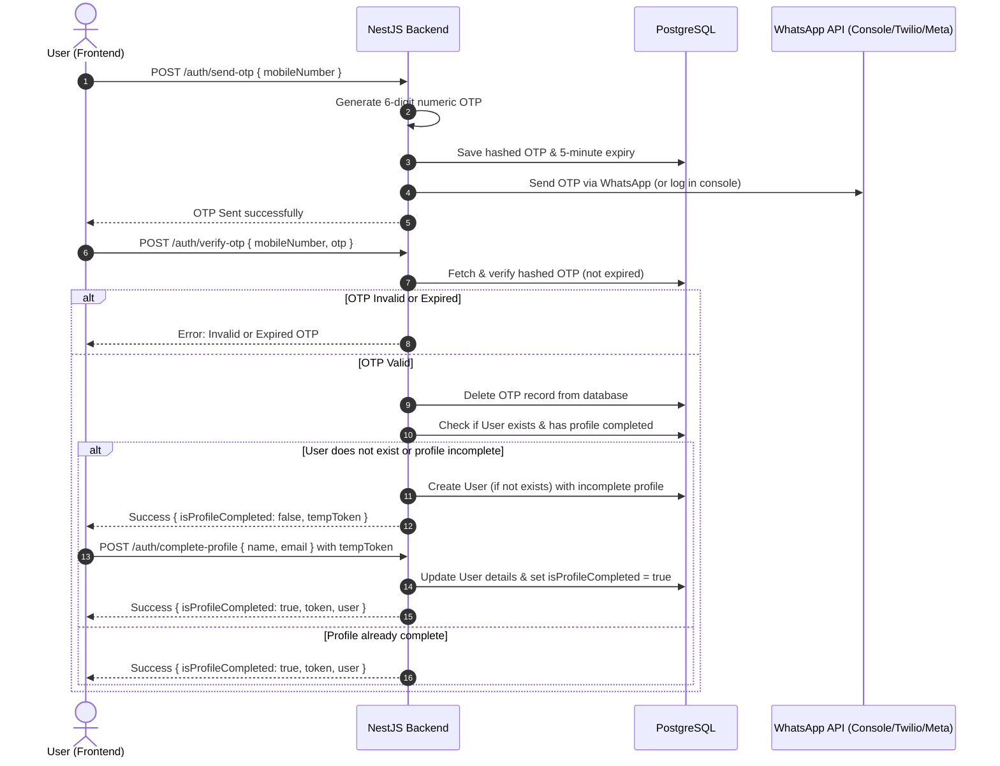

# Gentlemen Cricket Ground - WhatsApp OTP Authentication Setup Guide

This document explains the architecture, file structure, configuration, and verification steps for the WhatsApp OTP authentication system we have implemented.

---

## 🏗️ Architecture & Authentication Flow

Below is the sequence diagram illustrating how a user logs in, receives an OTP on WhatsApp, and completes their profile.



---

## 📁 Created & Modified Files

The authentication setup spans both the backend (NestJS/Prisma) and frontend (React/Vite).

### 1. Database & Migrations
- **[backend/prisma/schema.prisma](file:///c:/Users/91820/Documents/gentlemen-cricket-ground/backend/prisma/schema.prisma)**: Defines the `User` and `Otp` database tables.
- **[backend/src/prisma/prisma.service.ts](file:///c:/Users/91820/Documents/gentlemen-cricket-ground/backend/src/prisma/prisma.service.ts)**: Interconnects Prisma client with the NestJS lifecycle.
- **[backend/src/prisma/prisma.module.ts](file:///c:/Users/91820/Documents/gentlemen-cricket-ground/backend/src/prisma/prisma.module.ts)**: Global wrapper making `PrismaService` available to all NestJS controllers.

### 2. Backend Authentication Logic
- **[backend/src/modules/auth/auth.service.ts](file:///c:/Users/91820/Documents/gentlemen-cricket-ground/backend/src/modules/auth/auth.service.ts)**: Logic for OTP salting/hashing (`bcryptjs`), validation checks, and signing JWT tokens.
- **[backend/src/modules/auth/auth.controller.ts](file:///c:/Users/91820/Documents/gentlemen-cricket-ground/backend/src/modules/auth/auth.controller.ts)**: Declares routing controllers (`/send-otp`, `/verify-otp`, `/complete-profile`, `/me`).
- **[backend/src/modules/auth/auth.guard.ts](file:///c:/Users/91820/Documents/gentlemen-cricket-ground/backend/src/modules/auth/auth.guard.ts)**: Custom JWT validation interceptor.
- **[backend/src/modules/auth/auth.module.ts](file:///c:/Users/91820/Documents/gentlemen-cricket-ground/backend/src/modules/auth/auth.module.ts)**: Integrates routes, JWT token configs, and external services.

### 3. WhatsApp Integration
- **[backend/src/modules/whatsapp/whatsapp.service.ts](file:///c:/Users/91820/Documents/gentlemen-cricket-ground/backend/src/modules/whatsapp/whatsapp.service.ts)**: Integrates console logging, Twilio REST API, and Meta Graph Cloud API.
- **[backend/src/modules/whatsapp/whatsapp.module.ts](file:///c:/Users/91820/Documents/gentlemen-cricket-ground/backend/src/modules/whatsapp/whatsapp.module.ts)**: Wraps the WhatsApp client service.

### 4. React Frontend (Single Page UI)
- **[frontend/src/App.tsx](file:///c:/Users/91820/Documents/gentlemen-cricket-ground/frontend/src/App.tsx)**: Manages views (Phone submission, 6-digit code entry, Profile completion, Dashboard) and localStorage tokens.
- **[frontend/src/index.css](file:///c:/Users/91820/Documents/gentlemen-cricket-ground/frontend/src/index.css)**: Glassmorphic dark card design stylesheet with smooth button-press scale downs, inputs validation, and glowing animations.

---

## ⚙️ How to Configure the Real WhatsApp Gateway

Edit the environment variables in **[backend/.env](file:///c:/Users/91820/Documents/gentlemen-cricket-ground/backend/.env)**:

### Option A: Using Twilio WhatsApp API
1. Modify credentials in `.env`:
   ```env
   WHATSAPP_PROVIDER=twilio
   TWILIO_ACCOUNT_SID=your_twilio_sid
   TWILIO_AUTH_TOKEN=your_twilio_auth_token
   TWILIO_FROM_NUMBER=whatsapp:+14155238886  # Standard Twilio sandbox number
   ```
2. Save the file and restart the container:
   ```powershell
   docker compose -f compose.dev.yml restart backend
   ```

### Option B: Using Meta official WhatsApp Cloud API
1. Register a Meta Developer App, configure your WhatsApp business profile, and fetch credentials.
2. Edit `.env`:
   ```env
   WHATSAPP_PROVIDER=meta
   META_ACCESS_TOKEN=your_meta_system_user_access_token
   META_PHONE_NUMBER_ID=your_meta_phone_number_id
   META_TEMPLATE_NAME=your_pre_approved_otp_template  # Recommended
   ```
3. Save the file and restart the container:
   ```powershell
   docker compose -f compose.dev.yml restart backend
   ```

---

## 🔍 How to Run and Test in Terminal

To verify the setup:

1. **Boot Docker Services**:
   ```powershell
   ./scripts/up.ps1
   ```
2. **Monitor Logs**:
   ```powershell
   docker compose -f compose.dev.yml logs backend -f
   ```
3. **Simulate OTP Request**:
   ```powershell
   curl -X POST http://localhost:3000/auth/send-otp -H "Content-Type: application/json" -d "{\"mobileNumber\":\"+919876543210\"}"
   ```
4. Check terminal logs for the printed code and input it into the web UI at **`http://localhost:5173`**.
