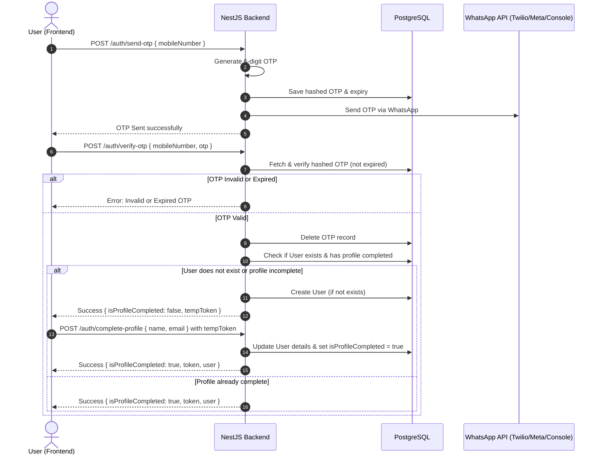

# WhatsApp OTP Authentication Plan

We will build a full-stack authentication system that allows users to sign in using their mobile number. The system will generate an OTP, store a hashed version in a PostgreSQL database with a 5-minute expiry, and send the OTP to the user's mobile number via WhatsApp. After verifying the OTP, users will either be logged in (if their profile is complete) or routed to a profile creation page.

---

## User Review Required

> [!IMPORTANT]
> **WhatsApp Gateway Providers**
>
> We will implement a flexible WhatsApp sending service with three modes configurable in `.env`:
> 1. **`console` (Default)**: Logs the OTP to the NestJS application console. Recommended for local testing to avoid setting up paid developer APIs.
> 2. **`twilio`**: Uses Twilio's WhatsApp API. Requires a Twilio Account SID, Auth Token, and Twilio WhatsApp number.
> 3. **`meta`**: Uses official Meta WhatsApp Cloud API. Requires a Meta Developer Phone Number ID, Access Token, and a pre-approved message template name.
>
> We will pre-configure the system to use the `console` mode so that you can run and test the complete application immediately without any API keys.

---

## Proposed Changes

### Database & Backend Setup

#### [NEW] [schema.prisma](file:///c:/Users/91820/Documents/gentlemen-cricket-ground/backend/prisma/schema.prisma)
Define the database schema:
- `User`: holds user credentials, status of profile, name, email, etc.
- `Otp`: stores hashed OTP, expiry timestamp, and reference phone number.

#### [NEW] [prisma.service.ts](file:///c:/Users/91820/Documents/gentlemen-cricket-ground/backend/src/prisma/prisma.service.ts)
A global NestJS service to interface with the Prisma Client.

#### [NEW] [whatsapp.service.ts](file:///c:/Users/91820/Documents/gentlemen-cricket-ground/backend/src/modules/whatsapp/whatsapp.service.ts)
Integrate the WhatsApp sender interface supporting console logging, Twilio, and Meta.

#### [NEW] [auth.controller.ts](file:///c:/Users/91820/Documents/gentlemen-cricket-ground/backend/src/modules/auth/auth.controller.ts)
Expose the endpoints:
- `POST /auth/send-otp`
- `POST /auth/verify-otp`
- `POST /auth/complete-profile` (Protected)
- `GET /auth/me` (Protected)

#### [NEW] [auth.service.ts](file:///c:/Users/91820/Documents/gentlemen-cricket-ground/backend/src/modules/auth/auth.service.ts)
Implement business logic: generating/hashing OTP, comparing OTP, JWT token generation, and user status queries.

#### [NEW] [auth.guard.ts](file:///c:/Users/91820/Documents/gentlemen-cricket-ground/backend/src/modules/auth/auth.guard.ts)
Custom NestJS AuthGuard to verify JWT tokens and attach the current user object to the request.

#### [MODIFY] [app.module.ts](file:///c:/Users/91820/Documents/gentlemen-cricket-ground/backend/src/app.module.ts)
Import the `PrismaModule` and `AuthModule`.

#### [MODIFY] [.env](file:///c:/Users/91820/Documents/gentlemen-cricket-ground/backend/.env)
Add environment variables for JWT secret, WhatsApp provider configuration, and credentials.

---

### Frontend Setup

We will initialize a clean Vite + React + TypeScript app in the `/frontend` folder and craft a premium user interface using vanilla CSS:
1. **Dynamic Phone Entry Screen**: A clean container with glassmorphic cards, custom animations, and a flag dropdown or format validation for mobile numbers.
2. **OTP Verification Screen**: A 6-character digit-by-digit code input field featuring auto-focus shift, resend OTP timer, and validation.
3. **Profile Creation Screen**: Appears for new users, requesting Name and Email with subtle floating label animations.
4. **App Dashboard**: Displays logged-in state, user info, and a logout button.

---

## Verification Plan

### Automated Verification
1. Run database migrations using Prisma.
2. Build and start services using Docker Compose.
3. Run Jest tests on the auth endpoints or manually trigger integration checks.

### Manual Verification
1. Open the web app on `http://localhost:5173`.
2. Input a test phone number (e.g. `+919876543210`).
3. View the generated OTP in the terminal logs (in `console` mode).
4. Enter the OTP, proceed to the Profile creation screen.
5. Create the profile and ensure it signs the user in and loads the dashboard.
6. Refresh the page to verify persistence via JWT stored in localStorage.
